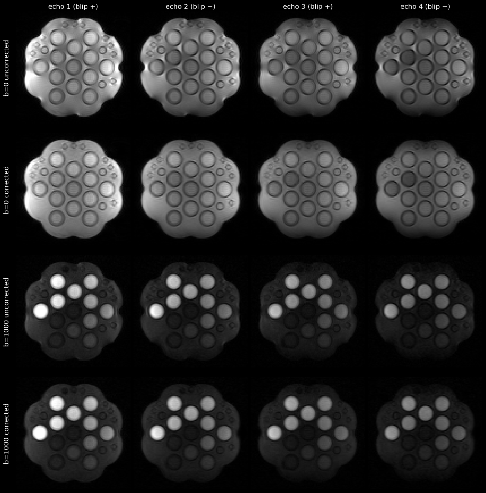

# undistortme

Susceptibility distortion correction for **multi-echo EPI** powered by FSL
[TOPUP](https://fsl.fmrib.ox.ac.uk/fsl/fslwiki/topup). `undistortme` ingests
DICOMs (or an already-converted BIDS-like NIfTI tree), estimates the
distortion field from the alternating phase-encoding of the echoes, and
applies the correction to each echo separately (preserving per-echo intensity
across T2 decay). Runs are processed one at a time; within a run it
parallelizes across b-volumes/averages and — with `-s` — across individual
slices. Echoes 1 & 3 can be contrast-matched to echo 2 before field
estimation.

If you use this tool, please cite:

Coll‐Font, J., Afacan, O., Hoge, S., Garg, H., Shashi, K., Marami, B., Gholipour, A., Chow, J., Warfield, S. and Kurugol, S., 2021. Retrospective distortion and motion correction for free‐breathing DW‐MRI of the kidneys using dual‐echo EPI and slice‐to‐volume registration. Journal of Magnetic Resonance Imaging, 53(5), pp.1432-1443.

Utkur, Mustafa, Liam Timms, Sila Kurugol, and Onur Afacan. “Ultrafast and Robust T2 Mapping Using Optimized Single‐shot Multi‐echo Planar Imaging with Alternating Blips.” Magnetic Resonance in Medicine, April 28, 2025, mrm.30516. https://doi.org/10.1002/mrm.30516.

Timms, Liam, Mustafa Utkur, Cemre Ariyurek, Miriam Hewlett, Sila Kurugol, and Onur Afacan. “Fast, Robust T2 ‐ IVIM Quantitative MRI With Distortion and Motion‐Corrected Multi‐Echo EPI.” Magnetic Resonance in Medicine 95, no. 5 (2026): 2527–37. https://doi.org/10.1002/mrm.70256.

Underlying libraries and tools leveraged here, notably TOPUP, have their own liscensing and citations. Please see associated documentation.

## Quickstart with Docker

The image bundles Python, FSL's TOPUP components, dcm2niix, and slicenii —
you need only Docker.

```bash # prebuilt image (published for releases v0.1.0 and later)
docker run --rm --user "$(id -u):$(id -g)" -v "$PWD":/data \
    ghcr.io/liamtimms/undistortme -i /data/sourcedata -o /data -d -t

# or build it yourself
git clone https://github.com/liamtimms/undistortme
docker build -t undistortme undistortme/
docker run --rm --user "$(id -u):$(id -g)" -v "$PWD":/data \
    undistortme -i /data/sourcedata -o /data -d -t
```

`--user "$(id -u):$(id -g)"` makes the container write outputs as your own
user; without it, the container's internal user usually cannot write to the
mounted directory (and any files it did write would not be owned by you).

Images are published to `ghcr.io/liamtimms/undistortme` (`:<version>` and
`:latest`) by CI whenever a `v*` tag is pushed; before the first tagged
release, build locally as shown above.

> **FSL licensing:** the image contains FSL, which the University of Oxford
> licenses for **non-commercial use only**
> ([license](https://fsl.fmrib.ox.ac.uk/fsl/docs/license.html)). FSL is
> downloaded from Oxford's own servers at image build time; this repository
> does not redistribute FSL. Commercial users must obtain an FSL licence from
> Oxford University Innovation. `undistortme` itself is MIT;
> [dcm2niix](https://github.com/rordenlab/dcm2niix) is BSD.

## test with the bundled example data

`examples/` ships a minimal 4-echo phantom acquisition (Siemens Prisma, one
b = 0 and one b = 1000 volume per echo, 128×128×10 at 1.72×1.72×7.5 mm,
~2.6 MB) already in this pipeline's input layout, plus reference corrected
outputs.



To test your setup:

```bash
# 1. whole-volume correction (pervol.cnf = FSL's default config with
#    TOPUP's motion estimation turned off, as it should be for volumes
#    acquired together):
docker run --rm --user "$(id -u):$(id -g)" -v "$PWD/examples":/data \
    undistortme -o /data -t -c /src/undistortme/configs/pervol.cnf \
    --derivdir /data/derivatives

# 2. slice-wise + contrast-matched correction (per-slice TOPUP config):
docker run --rm --user "$(id -u):$(id -g)" -v "$PWD/examples":/data \
    undistortme -o /data -t -s -m -c /src/undistortme/configs/perslice_1.cnf \
    --derivdir /data/derivatives

# compare both against the bundled references (PASS/FAIL per volume):
python3 examples/verify_example.py                      # needs numpy + nibabel
# ...or, without any local python environment:
docker run --rm -v "$PWD/examples":/data --entrypoint python undistortme \
    /data/verify_example.py /data/derivatives
```

For a native install (needs FSL, and slicenii for step 2) the same test is:

```bash
undistortme -o examples -t -c configs/pervol.cnf \
    --derivdir examples/derivatives
undistortme -o examples -t -s -m -c configs/perslice_1.cnf \
    --derivdir examples/derivatives
python3 examples/verify_example.py
```

## Native install

Requires Python ≥ 3.10 (CI tests 3.10 / 3.12 / 3.14).

```bash
pip install git+https://github.com/liamtimms/undistortme
```

Plus, on your `PATH`:

- **FSL** (`topup`, `applytopup`, `fslmerge`, `fslmaths`) — FSL ≥ 6.0.6
  recommended (earlier versions lack or mishandle TOPUP multithreading)
- **dcm2niix** — only if converting DICOMs (`-d`)
- **[slicenii](https://github.com/liamtimms/slicenii)** (`slicenii`,
  `combinenii`) — only for slice-by-slice mode (`-s`).

The TOPUP configs in `configs/` are not installed with the package — get
them from this repository (in the Docker image they are at
`/src/undistortme/configs/`).

## Usage

```
undistortme [-h] [-i INPUT_DIR] [-u SUBJECT_DIR] [-o OUTPUT_DIR]
            [--derivdir DERIVDIR] [--workdir WORKDIR] [-c CONFIG_FILE]
            [-t] [-d] [-s] [-m] [-n] [--twoecho] [--maskdir MASKDIR]
            [--fix-names] [--cutoff CUTOFF] [--jobs JOBS]
            [--oversubscribe OVERSUBSCRIBE]
```

| Option                | Meaning                                                                                                                                                                |
| --------------------- | ---------------------------------------------------------------------------------------------------------------------------------------------------------------------- |
| `-i, --input_dir`     | directory of DICOMs to convert; only used with `-d` (default `./sourcedata`)                                                                                           |
| `-o, --output_dir`    | root of the BIDS-like NIfTI tree (default `./`)                                                                                                                        |
| `-u, --subject_dir`   | process a single subject **label** (e.g. `sub-01`) under `--output_dir` instead of globbing `sub-*`                                                                    |
| `-d, --run_dcm2niix`  | convert DICOMs first (skip if you already have NIfTI + JSON)                                                                                                           |
| `-t, --run_topup`     | run TOPUP correction (required for anything to happen)                                                                                                                 |
| `-c, --config_file`   | TOPUP config (default: FSL's `b02b0.cnf`; see `configs/` and the note below)                                                                                           |
| `-s, --slice`         | correct slice-by-slice (needs slicenii; pair with `configs/perslice_1.cnf`)                                                                                            |
| `-m, --matchcontrast` | TE-weighted geometric-mean combination of echoes 1 & 3 to match echo 2's contrast; requires ≥ 3 echoes (runs with fewer are skipped entirely)                          |
| `--twoecho`           | use only the first two echoes; no effect on 2-echo runs, ignored when `-m` is given                                                                                    |
| `--maskdir`           | directory of masks (see Masking below)                                                                                                                                 |
| `--derivdir`          | final outputs root (default `./derivatives`)                                                                                                                           |
| `--workdir`           | intermediates root (default `<derivdir>/undistortme-work`)                                                                                                             |
| `--fix-names`         | strip `.` characters from subject file/dir names; only triggered when a `sub-*` name contains a dot (mutates the input tree!)                                          |
| `--jobs`              | parallel workers (default: cores in the process affinity mask)                                                                                                         |
| `--oversubscribe`     | TOPUP thread oversubscription factor (default 4.0; see Performance)                                                                                                    |
| `--cutoff`            | b-value at or below which TOPUP is fit; higher-b volumes reuse the field of the most similar low-b volume (default 1000; only used when a run has >1 distinct b-value) |
| `-n, --dryrun`        | print every command instead of executing (output directories are still created)                                                                                        |

### Contrast matching CLI

The contrast-matching step is also installed as a standalone tool:

```
undistortme-contrastmatch -i IMG1 IMG3 -t TE1 TE3 -n TARGET_TE -o OUT [-m linear|geomean]
```

The pipeline always invokes it with `-m geomean` (Weiskopf et al. 2005); the
standalone default is `linear`. It refuses to overwrite an existing output.

### Input layout

Without `-d`, point `-o` at a tree shaped like this pipeline's `dcm2niix`
output (BIDS-_like_, not BIDS-valid — `run-*` are directories and derivative
names are not BIDS-entity-ordered):

```
sub-{ID}/ses-{session}/run-{N}_desc-{name}/
├── sub-..._echo-1.json          # sidecar per echo (dcm2niix)
├── sub-..._echo-1_1.nii         # volume 1, echo 1
├── sub-..._echo-1_2.nii
├── sub-..._echo-1.bval          # optional, for diffusion runs
├── sub-..._echo-2.json
└── ...
```

- Volumes are uncompressed `.nii`, one 3D file per volume (`dcm2niix -z 3`
  output); `.nii.gz` is not read. Volumes are numbered `_1`…`_N`, zero-padded
  to the width of N (`_1.nii` for 4 volumes, `_01.nii` for 22).
- Sidecars must carry `EchoNumber`, `EchoTime`, `PhaseEncodingDirection`, and
  `TotalReadoutTime` (standard dcm2niix output). A missing `EchoNumber`
  makes every volume look like echo 1 and the run is skipped.
- Runs need ≥ 2 echoes with **alternating phase encoding**, echo 1
  assumed positive-blip: the blip sign is derived from echo parity, and the
  `+`/`-` in the sidecar's `PhaseEncodingDirection` sign is not consulted because it is unreliable (only
  the axis is).
- Optional `.bval` files (same stem as the sidecar, one value per volume)
  trigger the diffusion-specific path: TOPUP is fit on volumes with b ≤ `--cutoff`,
  and each higher-b volume is corrected with the field of the low-b volume
  most similar to it (by normalized mutual information).

_True_ BIDs support will require adding multi-echo DWI to the BIDS standard.

### Masking

`--maskdir` is searched (non-recursively) for
`{sub}_{ses}_{run}*-label.nii`, then `{sub}_{ses}_{run}*mask.nii`; the first
match wins. A run with no matching mask is processed **unmasked** and its
outputs land in the unmasked variant directory — check the `<variant>` in
your output paths when masking a mixed dataset.

### Outputs

```
derivatives/
├── undistortme/<variant>/sub-*/ses-*/run-*/   # corrected echoes
│                                              #  (+ recombined volumes in -s mode)
└── undistortme-work/<variant>/...             # everything else: estimated fields,
                                               #  topup coefficients/movpar, acqparams,
                                               #  merged/contrast-matched/masked/sliced
                                               #  intermediates
```

`<variant>` records the correction mode (`whole-volume`, `per-slice`, plus
`_contrast-matched` / `_masked` / `_two-echo`). Corrected images are named
`*_desc-undistorted-<variant>_echo-{e}_sv-{s}.nii`. The work tree can be
deleted once you are happy with the corrected images — **but the estimated
field maps live there**, so copy them out first if you want to keep them.
Keeping the work tree lets interrupted runs resume (existing outputs are
skipped).

### TOPUP configs

FSL's default `b02b0.cnf` needs images large enough for its subsampling
schedule; for small matrices or quick tests use `configs/pervol.cnf`, and
for slice-by-slice mode use `configs/perslice_1.cnf`.

## Performance

- `--jobs` bounds the worker pool. The default is the CPUs in the process
  affinity mask: `docker run --cpuset-cpus` is respected, but a `--cpus`
  quota is **not** — set `--jobs` explicitly when limiting a container with
  `--cpus`.
- TOPUP's own threads (`--nthr`) rarely reach full per-core utilization, so
  the pipeline deliberately oversubscribes: each concurrent TOPUP gets
  roughly `jobs × F / concurrent-topups` threads (never more than `jobs`),
  with `F` set by `--oversubscribe`. Measured on a 22-volume triple-echo
  diffusion run (20 cores): F=1 → 360 s, F=2 → 343 s, F=4 (default) → 315 s,
  F=8 → 304 s. Increase `F` if cores sit idle during whole-volume TOPUP
  batches; decrease toward 1 if the machine is shared.
- Slice mode (`-s`) forces each TOPUP single-threaded (`--oversubscribe` has
  no effect there) and instead parallelizes across the many per-slice jobs;
  pair it with `configs/perslice_1.cnf`.
- Reproducibility note: TOPUP's result depends slightly on its thread count
  (voxelwise differences on the order of 1e-4 of image intensity between
  thread settings; correlation > 0.9999). Runs with identical settings on
  the same machine are bit-reproducible. For bit-identical results across
  machines, pin `--jobs` and `--oversubscribe`.

## Testing

```bash
git clone https://github.com/liamtimms/undistortme && cd undistortme
pip install -e ".[test]"
python -m pytest tests/                                 # no FSL needed
python -m pytest tests/test_smoke_fsl.py -m "slow or needs_fsl"  # real FSL phantom
```

The default suite pins every generated command as snapshots and
executes no external binaries. The smoke tests **skip** if FSL (or, for the
slice-mode smoke, slicenii) is not found; set `UNDISTORTME_REQUIRE_FSL=1` to
turn those skips into failures (CI does this before publishing images).

## License

MIT for this repository's code. FSL (used at runtime, bundled in the Docker
image at build time from Oxford's servers) is free for non-commercial use
only please see appropriate liscensing if you use this tool; dcm2niix is BSD;
slicenii is also by me and will be liscensed MIT as well.
